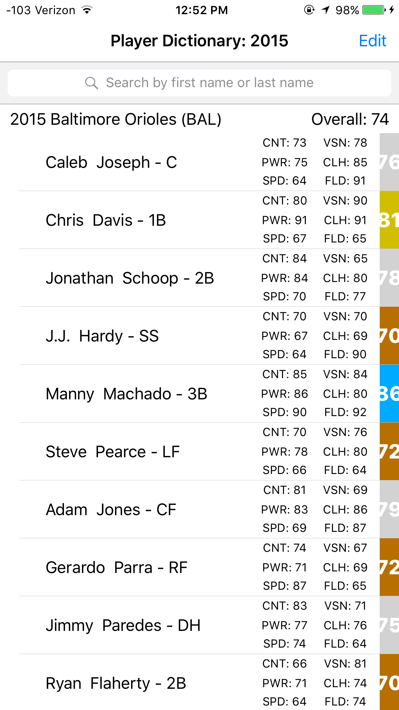
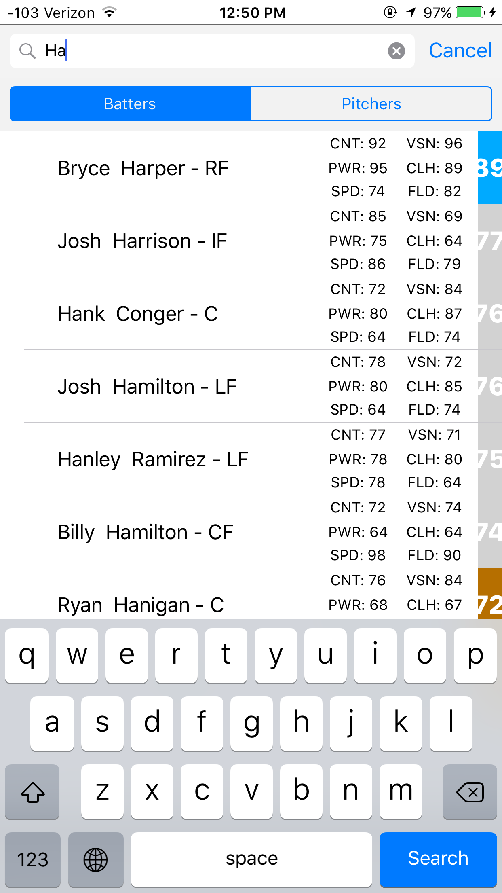
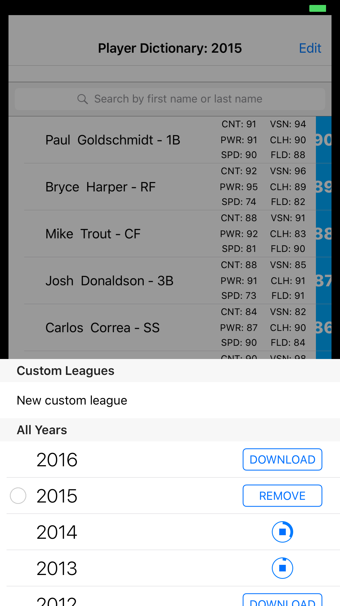
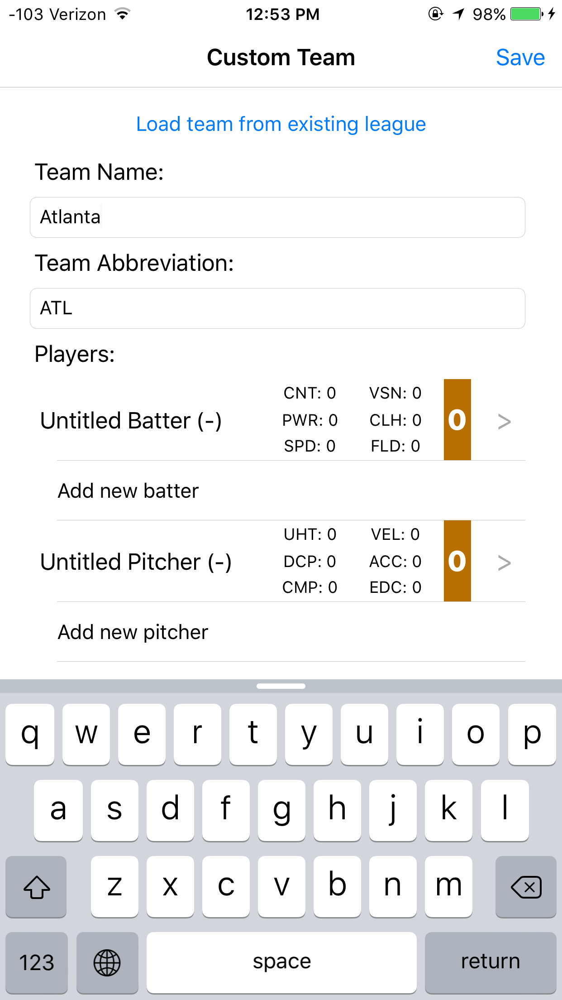
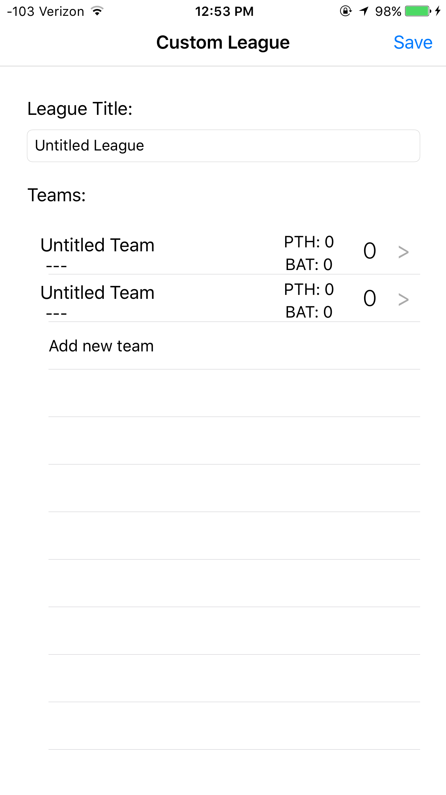

# BaseballGame_iOS
Current: Pulls data from baseballrefence.com and uses in-depth alrorithims to create player and team ratings. Allows user to load any year between the current year and 1901 as well as the ability to make their own custom league.

Goal: A full-fledged baseball game based on real MLB players and driven by real data converted into game stats. Would feature a play now mode in addition to others.

To install: 
    Make sure you have CocoaPods installed on your computer (https://cocoapods.org) and that the pod is initialized in the Homework folder. When opening the project, make sure you open the .xcworkspace file and NOT the .xcodeproj file. By default, the app loads the current year's roster as an example.

Utilizes:
  -DownloadButton
  -Hpple
  -MGSwipeTableCell
  -UCZPogressView
  -ZFDragableModalTransition
  -Core Data

###Main view

###League menu

###Custom league

